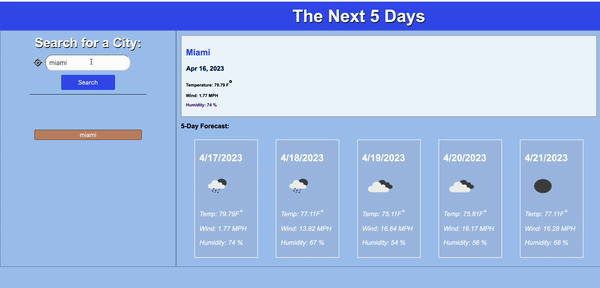
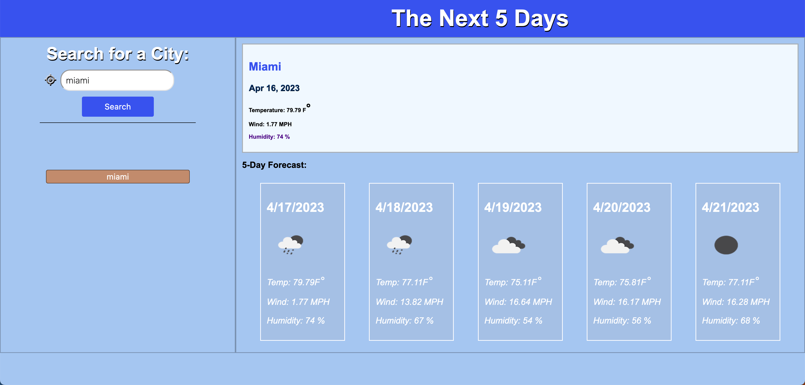

# TheNext5Days

## Description

    Enter a USA city and expect to get the weather forecast for the next 5 Days.

## Screenshots & Demo
-   
-   

##
- Deployed App [TheNext5Days](https://roketteere.github.io/thenext5days/)
## Resources

- Day.js - Formatting incoming date from OpenWeatherMap API
  - [Day.js](https://day.js.org/)
- OpenWeatherMap - API used to send coordinates, lon & lat along with the city
  name, to their servers to display and update back to the client (user). -
  [OpenWeatherMap](https://openweathermap.org/)
